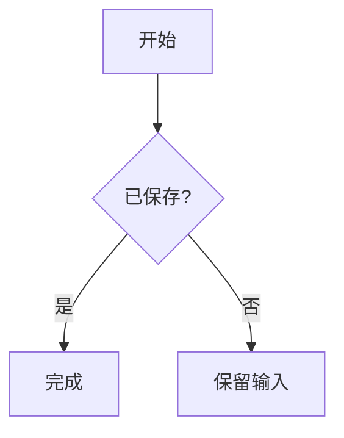
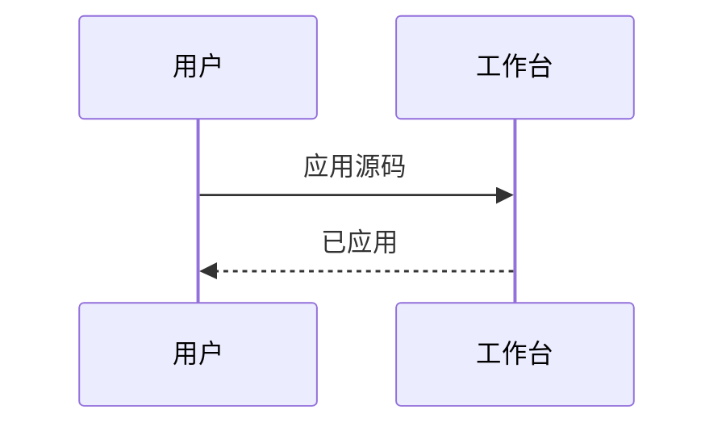
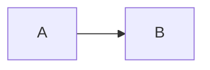

# Mermaid 图表样例

流程图保留中文标签、特殊字符和相邻正文格式。

```mermaid
flowchart TD
  A[开始] --> B{已保存?}
  B -->|是| C[完成]
  B -->|否| D[保留输入]
```

时序图保存原始缩进和注释。

```mermaid
sequenceDiagram
  participant 用户
  participant 工作台
  %% 原始注释
  用户->>工作台: 应用源码
  工作台-->>用户: 已应用
```

错误示例应显示诊断并允许复制源码。

```mermaid
flowchart TD
  A[未闭合
```

含交互的源码应保留并显示限制说明。

```mermaid
flowchart LR
  A --> B
  click A "https://example.invalid"
```
